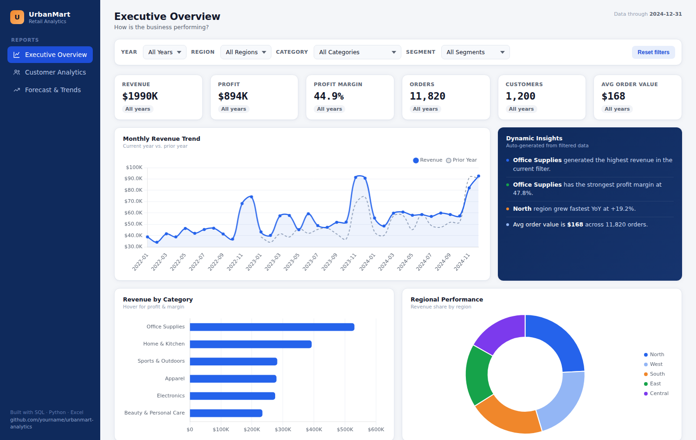
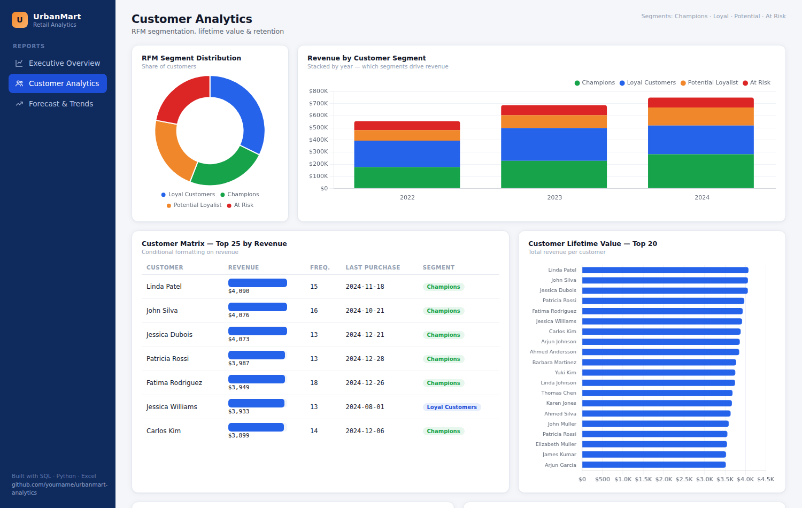
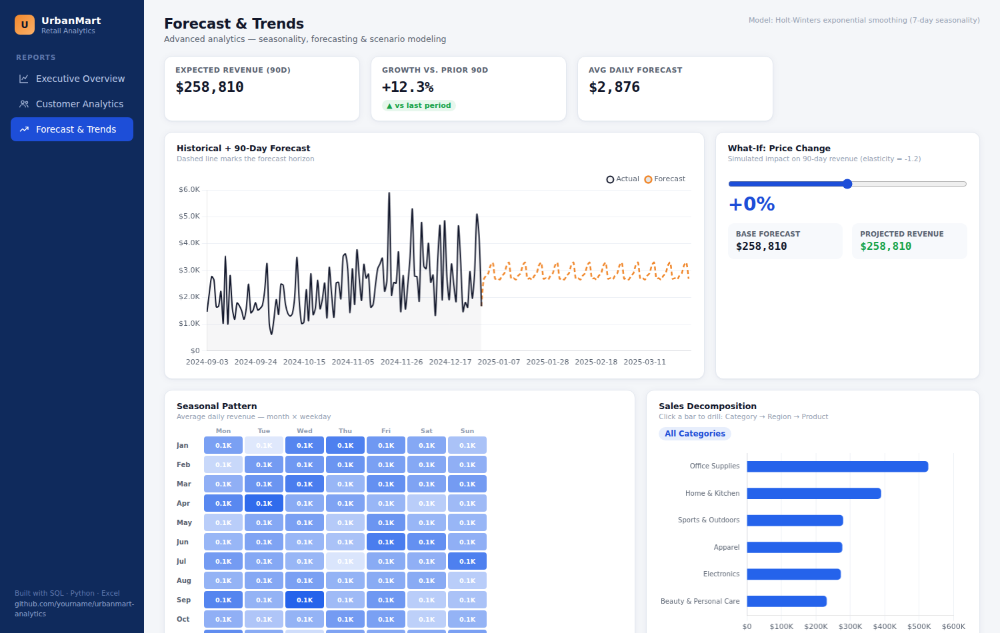

# UrbanMart Retail Analytics — End-to-End Sales & Customer Analysis

**SQL · Python · Power BI · Excel** — a full analyst workflow on 3 years of
retail transaction data (2022–2024): 20,700+ order lines, 1,200 customers,
33 products across 6 categories.

## 📊 Live Interactive Dashboard
**[Open the dashboard](dashboard/index.html)** — a fully interactive, 3-page
analytics dashboard (Executive Overview, Customer Analytics, Forecast & Trends)
built as a self-contained HTML file so it works instantly in any browser or on
GitHub Pages — no install required. Filter by year/region/category/segment,
drill into the sales decomposition tree, and try the price what-if slider.

> To view it live on GitHub Pages: Settings → Pages → deploy from `/dashboard`,
> then link it here: `🔗 Live Dashboard: <your-github-pages-url>`

| Executive Overview | Customer Analytics | Forecast & Trends |
|---|---|---|
|  |  |  |

## Business questions answered
- What's driving revenue growth (or decline) month over month, and by how much YoY?
- Which categories and regions are most profitable — not just highest-revenue?
- Which customers are our most valuable, and which are at risk of churning? (RFM segmentation)
- What should we expect in sales over the next 90 days?

## Project structure
```
├── data/
│   ├── generate_dataset.py     # builds the synthetic-but-realistic dataset
│   ├── sales_data.csv, customers.csv, products.csv
│   └── urbanmart.db            # SQLite version for direct SQL querying
├── sql/
│   ├── 01_schema.sql           # table definitions, indexes
│   └── 02_business_queries.sql # KPIs, YoY growth, RFM, cohort retention, window functions
├── python/
│   ├── analysis.py             # cleaning, EDA, KMeans RFM segmentation, Holt-Winters forecast
│   ├── prepare_dashboard_data.py  # aggregates everything into dashboard_data.json
│   └── output/                 # generated CSVs + charts consumed by dashboard, Power BI & Excel
├── dashboard/
│   ├── index.html               # ⭐ the interactive dashboard — open this file directly
│   ├── build_dashboard.py       # regenerates index.html from template + latest data
│   ├── index.template.html / dashboard.js / chart.umd.js
│   └── screenshots/
├── excel/
│   ├── build_excel_dashboard.py
│   └── UrbanMart_Sales_Dashboard.xlsx   # formula-driven pivot summary + charts
└── powerbi/
    ├── DAX_measures.txt
    └── dashboard_build_guide.md         # step-by-step .pbix build instructions
```

## What each tool does in this project

| Tool | Role |
|---|---|
| **SQL** | Source-of-truth queries: KPI rollups, YoY growth (`LAG` window function), RFM scoring (`NTILE`), cohort retention, running totals |
| **Python** | Data cleaning, exploratory analysis, RFM customer segmentation via **KMeans clustering**, 90-day sales forecast via **Holt-Winters exponential smoothing**, chart generation |
| **Power BI** | Interactive 3-page executive dashboard: overview KPIs, customer segmentation, forecast/trends — with DAX measures for time intelligence (YoY, MTD, running totals) |
| **Excel** | Stakeholder-friendly summary workbook — fully formula-driven (SUMIFS-based pivots, zero hardcoded values) so it stays live if data is refreshed |

## Key findings
- **$1.99M** total revenue, **44.9%** profit margin across the 3-year window
- Revenue grows ~15%/year with a strong **Nov–Dec seasonal spike** (holiday demand)
- **Electronics** and **Office Supplies** are the top two categories by revenue, but *Office Supplies* has the highest margin
- RFM segmentation splits customers into 4 groups — **Champions** (top 24%) drive a disproportionate share of revenue, while **At Risk** customers (22%) represent a clear win-back target
- 90-day forecast projects continued steady growth with the same weekly/holiday seasonality pattern

## How to reproduce
```bash
# 1. Generate the dataset
cd data && python generate_dataset.py

# 2. Load into SQL (SQLite example already included as urbanmart.db,
#    or run sql/01_schema.sql + sql/02_business_queries.sql on Postgres/MySQL)

# 3. Run the Python analysis (cleaning, RFM, forecast, charts)
cd ../python && pip install pandas numpy scikit-learn statsmodels matplotlib
python analysis.py

# 4. Build the Excel dashboard
cd ../excel && pip install openpyxl
python build_excel_dashboard.py

# 5. Build the interactive HTML dashboard
cd ../python && python prepare_dashboard_data.py
cd ../dashboard && python build_dashboard.py
# then just open dashboard/index.html in any browser

# 6. Build the Power BI dashboard — see powerbi/dashboard_build_guide.md
```

## Skills demonstrated
`SQL window functions & CTEs` · `RFM customer segmentation` · `KMeans clustering`
· `time series forecasting` · `DAX & data modeling` · `dynamic Excel formulas`
· `data storytelling` · `end-to-end pipeline design`

---
*Dataset is synthetically generated with realistic seasonality/growth patterns
(see `data/generate_dataset.py`) so the project is fully reproducible and
self-contained — no external downloads required.*
